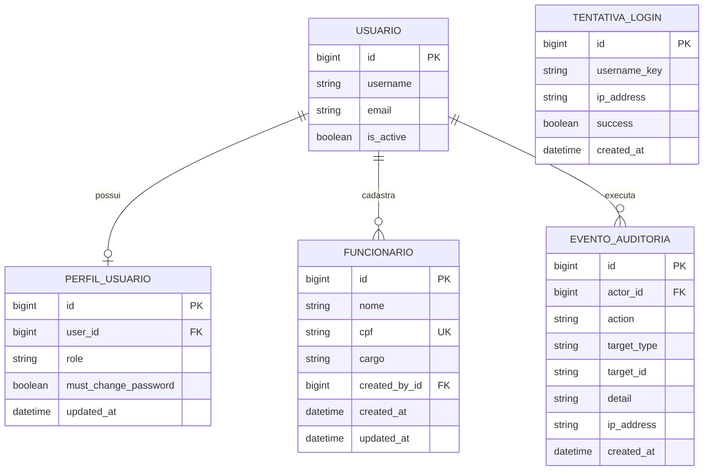

# Modelagem e requisitos do PromoInfo

Este documento descreve as estruturas que já existem no projeto. Ele não propõe
novas funcionalidades nem altera o banco de dados.

## Modelo conceitual

O núcleo administrativo possui cinco entidades relevantes:

- **Usuário**: identidade autenticada pelo Django.
- **Perfil de usuário**: papel e permissões de um usuário na área restrita.
- **Funcionário**: pessoa cadastrada pela equipe autorizada.
- **Evento de auditoria**: registro de uma operação relevante e de seu responsável.
- **Tentativa de login**: registro utilizado para proteção contra tentativas excessivas.

`Tentativa de login` guarda a identificação informada e o endereço IP, sem uma
chave estrangeira para `Usuário`, pois também precisa registrar tentativas feitas
com nomes de usuário inexistentes.

## Modelo lógico

O Django materializa o modelo conceitual nas tabelas abaixo. As chaves primárias
são `BigAutoField` e as datas usam os tipos de data/hora fornecidos pelo banco.

### `auth_user`

Tabela nativa do Django que armazena identidade, senha cifrada, e-mail, estado da
conta e indicadores administrativos.

### `marketplace_userprofile`

| Campo | Tipo lógico | Restrição |
| --- | --- | --- |
| `id` | bigint | PK |
| `user_id` | bigint | FK única para `auth_user`, exclusão em cascata |
| `role` | varchar(20) | master, rh, cadastro ou consulta |
| `must_change_password` | boolean | obrigatório |
| `updated_at` | timestamp | atualização automática |

### `marketplace_funcionario`

| Campo | Tipo lógico | Restrição |
| --- | --- | --- |
| `id` | bigint | PK |
| `nome` | varchar(150) | obrigatório |
| `cpf` | varchar(11) | obrigatório e único |
| `cargo` | varchar(100) | obrigatório |
| `created_by_id` | bigint | FK opcional para `auth_user`, `SET NULL` |
| `created_at` | timestamp | criação automática |
| `updated_at` | timestamp | atualização automática |

### `marketplace_auditevent`

| Campo | Tipo lógico | Restrição |
| --- | --- | --- |
| `id` | bigint | PK |
| `actor_id` | bigint | FK opcional para `auth_user`, `SET NULL` |
| `action` | varchar(80) | obrigatório |
| `target_type` | varchar(80) | opcional |
| `target_id` | varchar(80) | opcional |
| `detail` | varchar(500) | opcional |
| `ip_address` | varchar(64) | opcional |
| `created_at` | timestamp | criação automática |

### `marketplace_loginattempt`

| Campo | Tipo lógico | Restrição |
| --- | --- | --- |
| `id` | bigint | PK |
| `username_key` | varchar(150) | obrigatório e indexado |
| `ip_address` | varchar(64) | obrigatório e indexado |
| `success` | boolean | obrigatório |
| `created_at` | timestamp | criação automática e indexada |

## Requisitos funcionais

- **RF01 — Catálogo:** permitir a consulta e a busca de produtos e ofertas.
- **RF02 — Lojas e unidades:** apresentar lojas, marcas e unidades da PromoInfo.
- **RF03 — Comparação:** permitir comparar informações e preços do catálogo.
- **RF04 — Monte seu PC:** oferecer um fluxo guiado de seleção de componentes.
- **RF05 — Assistente Ana:** responder dúvidas pelo endpoint e pela interface existentes.
- **RF06 — Área restrita:** autenticar usuários internos e respeitar seus perfis.
- **RF07 — Funcionários:** listar, cadastrar, atualizar e excluir funcionários pela interface.
- **RF08 — API de funcionários:** disponibilizar GET, POST e PUT em JSON para usuários autorizados.
- **RF09 — Usuários e permissões:** permitir ao perfil master administrar acessos internos.
- **RF10 — Auditoria:** registrar operações administrativas relevantes.
- **RF11 — Proteção de acesso:** limitar tentativas repetidas e validar reCAPTCHA nos fluxos protegidos.

## Requisitos não funcionais

- **RNF01 — Segurança:** usar autenticação Django, autorização por perfil, CSRF,
  cookies seguros, HTTPS e validação do reCAPTCHA conforme o ambiente.
- **RNF02 — Integridade:** validar matematicamente o CPF e impedir CPFs duplicados.
- **RNF03 — Privacidade:** não expor chaves privadas e bloquear o envio de dados
  sensíveis ao provedor externo da assistente.
- **RNF04 — Rastreabilidade:** manter data, usuário e IP nos eventos de auditoria.
- **RNF05 — Compatibilidade:** executar com Django e PostgreSQL/Supabase em produção,
  preservando SQLite apenas para desenvolvimento e testes locais.
- **RNF06 — Usabilidade:** manter o frontend responsivo e acessível em dispositivos móveis e desktop.
- **RNF07 — Manutenibilidade:** separar regras, views, validações e testes automatizados.
- **RNF08 — Confiabilidade:** retornar códigos HTTP e mensagens JSON coerentes nos endpoints da API.

## API de funcionários

| Método | Endpoint | Capacidade exigida | Resultado |
| --- | --- | --- | --- |
| GET | `/api/funcionarios/` | visualizar funcionários | lista |
| POST | `/api/funcionarios/` | cadastrar funcionários | novo funcionário |
| GET | `/api/funcionarios/<id>/` | visualizar funcionários | funcionário consultado |
| PUT | `/api/funcionarios/<id>/` | editar funcionários | funcionário atualizado |

Os endpoints usam a sessão autenticada do Django e mantêm a proteção CSRF. POST
e PUT recebem um objeto JSON com `nome`, `cpf` e `cargo`.
